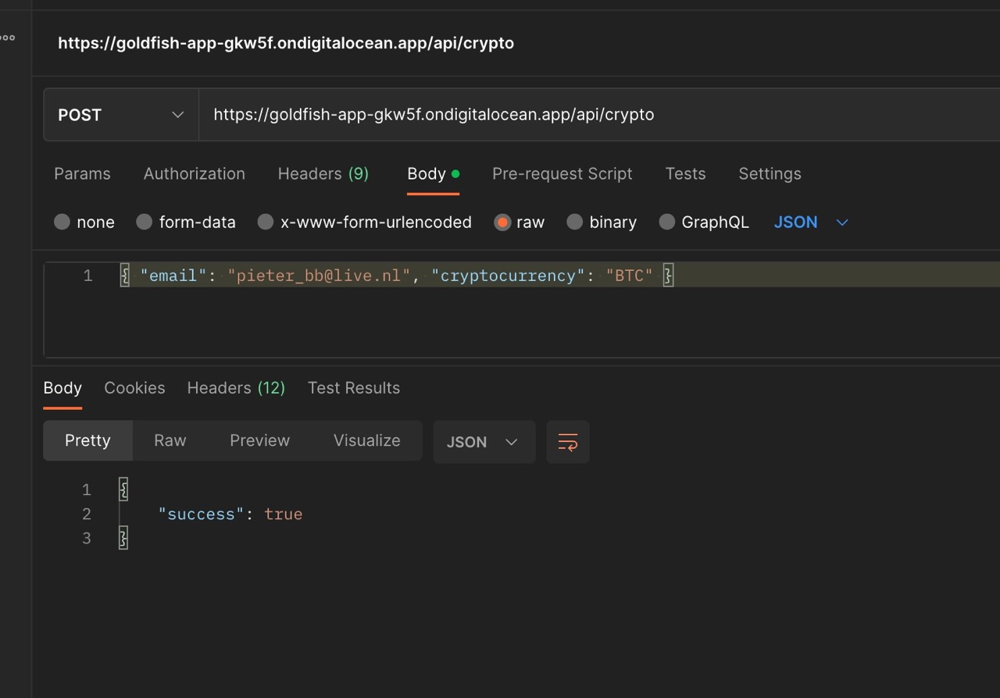
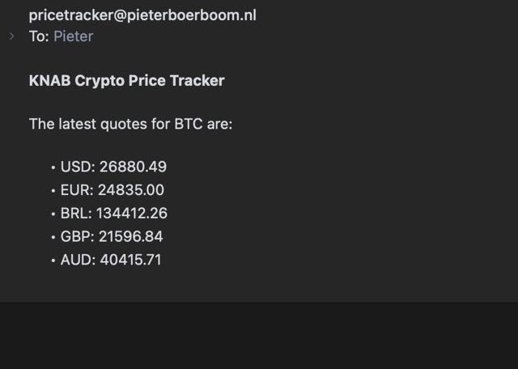

## Code Challenge KNAB

Pieter Boerboom - 21-05-2023 -
[LinkedIn](https://www.linkedin.com/in/pieterboerboom/) -
[Email](mailto:info@pieterboerboom.nl)

# Setup

Configure the .env file with the correct environment variables such as the API key and email server settings. To make it easy to see a working version of the application I've included my .env file. Normally this file would be excluded from the repository.

```
    npm install
    npm run start
```

The server is now running on port 3000.
Send a POST request to http://localhost:3000/ with the following body to receive price notifications for the given crypto currency code:

Per requirements the currency code is locked to BTC only at the moment.

```json
{
  "email": "example@example.com",
  "cryptoCurrencyCode": "BTC"
}
```

You can paste this cURL command in your terminal to try it out:

```
curl --location 'http://localhost:3000/api/crypto' \
--header 'Content-Type: application/json' \
--data-raw '{ "email": "info@pieterboerboom.nl", "cryptocurrency": "BTC" }'
```

# Test Instructions

Run the following command to run the tests:

```
    npm run test
```

# Deployment instructions

You can deploy this application to any cloud provider that supports Node.JS. You can also dockerize it and deploy it to a container platform or write Terraform scripts to deploy it to AWS, Azure or Google Cloud.

As an example we'll use the digitalocean.com Platform as a Service to deploy this app.

1. Create a Digital Ocean account
2. Create a new app in the Digital Ocean dashboard
3. Push the app to your personal Github repository using git
4. Connect your Github account to Digital Ocean in the Digital Ocean dashboard
5. Select your GitHub repository and branch in the Digital Ocean new app wizard
6. Adjust the pricing plan to your needs and select your deploymend region
7. Add your environment variables to the Digital Ocean project
8. Click create deployment and wait for the build to finish
9. Congratulations, your app is now deployed on the given URL and will redeploy when pushing to the main branch.



**You'll start receiving email alerts:**



**It works!**
